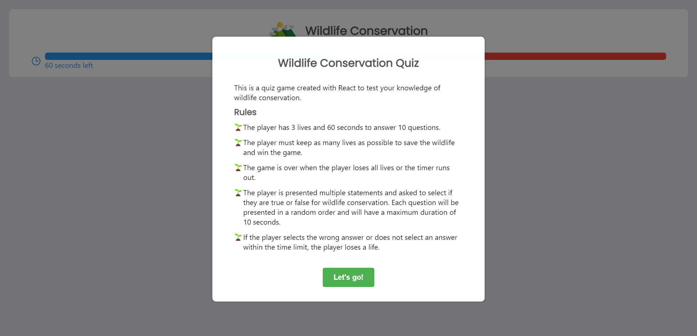
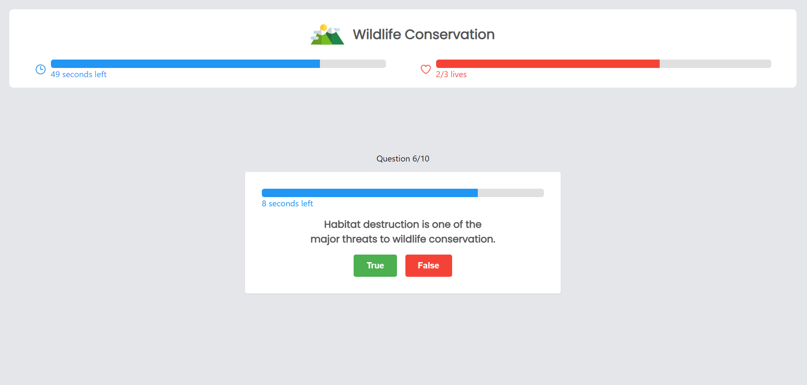

# Wildlife Conservation Quiz Game

## Preview

## Description

This is a quiz game created with React to test your knowledge of wildlife conservation.

### Rules

- The player has 3 lives and 60 seconds to answer 10 questions.
- The player must keep as many lives as possible to save the wildlife and win the game.
- The game is over when the player loses all lives or the timer runs out. 
- The player is presented multiple statements and asked to select if they are true or false for wildlife conservation. Each question will be presented in a random order and will have a maximum duration of 10 seconds. 
  - If the player selects the wrong answer, the next question is presented and the player loses a life.
  - If the player does not select an answer within the time limit, the next question is presented and the player loses a life. 

## Getting Started

1. Clone the repository.
2. Install dependencies with `npm install`.

## Development

To run the app, use `npm start` and open [http://localhost:3000](http://localhost:3000) to view it in the browser.

## Deployment

To deploy the app, use `npm run build` and copy the contents of the `build` folder to the server.
